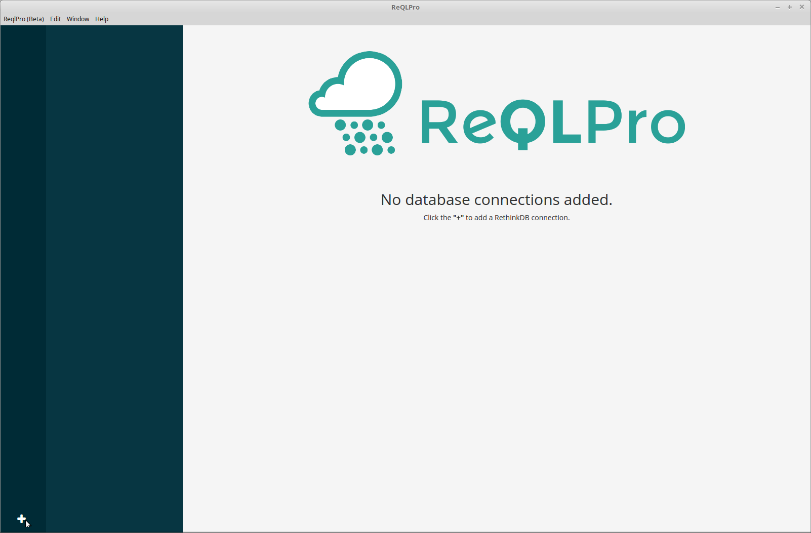
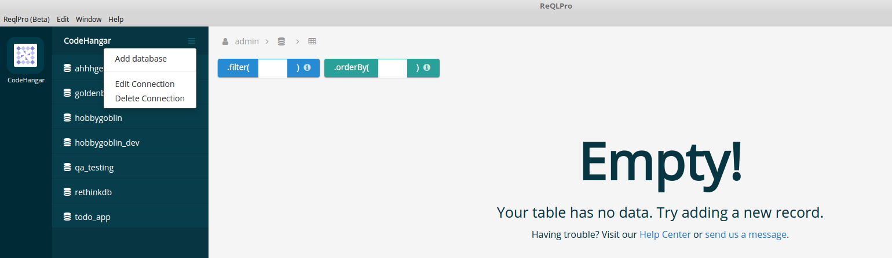
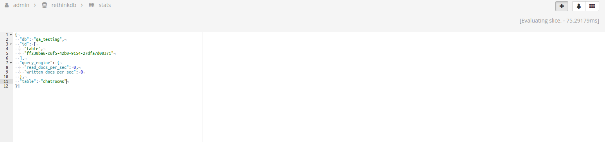

# ReQLPro User Walkthrough

Thanks for downloading ReQLPro! The following walkthrough will give you a good idea of what ReQLPro has to offer, showing you all available features and how to get the most from them.

## Getting Started
When you first run ReQLPro you won’t have any databases added, so your screen will look like the following.

In the bottom left corner you’ll see a ‘+’ sign. Hit that button to add a new RethinkDB connection. You’ll get the following popup when you do:

Give your database connection a name in the Connection Name field. It can be whatever you want it to be, but we recommend giving your databases names that are distinct and memorable.

Enter your database host in the Host field and the port in the Port field.

Enter the username in the User field and the Password in the password field.

If you have a SSL Certificate you can enter it in the SSL Certificate field. Check the “SSL Reject Unauthorized’ box if you want to reject connections that are not SSL authorized.

All of this can be edited later. In fact, we’ll show you how to do that next.

Once you’ve added your database it will show up with an icon in the column on the left hand side. The database name will also be shown in the wider column on the left, along with the names of all the tables it contains. You can edit your database connection, delete your database connection, or add a new database connection by clicking the triple-line icon to the right of the database name as shown below.

Now let’s take a look at managing your database records. Click on a table on the left to select it and display its records in the main panel. 

You can run rethinkdb search queries on your records using the ‘.filter’ and ‘.orderby’ fields at the top of the page. Make sure to format your queries just like they would be if you were using the node javascript driver (click the “i” icon for help)! You can see an example below. 

Let’s take a closer look at the controls in the top right hand corner, pictured below.

If your database is large, you can change the number of entries displayed per page by changing the ‘Rows per page’ dropdown. The plus sign lets you add a new database entry, which we’ll be exploring more shortly. The circular arrow button lets you refresh your current database query. The tree and grid buttons on the right let you switch between a tree view and a grid view of your query results. 

Let’s click the + sign to create a new entry.

Doing so will take you to the following view, where you can enter the new entry in standard form:

And that’s pretty much it! You should now have everything you need to get started with managing your rethinkdb connections. 

If you have any questions or concerns please feel free to email us at support@reqlpro.com
.com). 
Happy querying!
